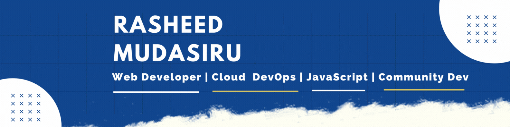
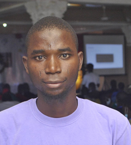

<h1 align="center" >Hey there :wave:, I'm <a href="https://www.linkedin.com/in/rasheedtaiwo/" target="_blank"> Rasheed Mudasiru </a></h1>
<!--  -->

<h1 align="center">About Me ⚡</h1>

I am a **software engineer** passionate about **solving problems** using **technologies**. With my experiences in the field computing, I believe technology is the solutions to the most of the problems facing humanity. I am proud to be solving problem and **support problem solvers**. 

<h3 align="center"> Web Developer | Cloud DevOps Engineer | Machine Learning | Community Dev</h3>

<h3>
 
</h3>
   

<h1>Technical Skills 🛠</h1>
   
Languages:	Golang, JavaScript, Python, C++.
Management:  Leadership, Communication, Critical Thinking, Emotional Intelligence.
Technologies: Golang for Cloud and Backend, DevOps, GenAI and Machine Learning.

 <h1 align="center">Let's Get Connected</h1>

<a href="mailto:rasheedrtm1@gmail.com">

   

   
   
<table>
  <tr>
   
<td>
    <td></td>
  </tr>
</table>

  

 
   
   

